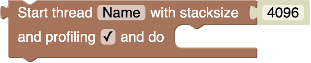
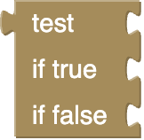
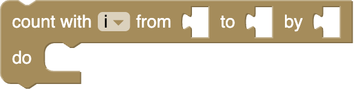

# Blockly Blocks Documentation

**Generated:** 2026-01-25

This documentation covers all 72 blocks used in the Megahub project, including 24 custom blocks and 48 standard Blockly blocks with custom colors.

Block images are rendered as high-quality PNG screenshots to accurately show all block features including text inputs, checkboxes, and statement blocks.

## Table of Contents

- [Control flow](#control-flow) (4 blocks)
- [Logic](#logic) (7 blocks)
- [Loop](#loop) (3 blocks)
- [Math](#math) (13 blocks)
- [Text](#text) (13 blocks)
- [Lists](#lists) (12 blocks)
- [I/O](#i-o) (5 blocks)
- [LEGO©](#lego-) (2 blocks)
- [Gamepad](#gamepad) (5 blocks)
- [FastLED](#fastled) (4 blocks)
- [IMU](#imu) (1 blocks)
- [UI](#ui) (1 blocks)
- [Debug](#debug) (2 blocks)

## Control flow

### mh_init

**Color:**  HSV 20

**Description:** Initialization

**Message:** `Initialization do %1`

**Inputs:**

| Name | Type | Check |
|------|------|-------|
| DO | input_statement | Any |

---

### mh_startthread

**Color:**  HSV 20

**Description:** Starts a thread

**Type:** Custom Statement Block

**Message:** `Start thread %1 with stacksize %2 and profiling %3 and do %4`

**Inputs:**

| Name | Type | Check |
|------|------|-------|
| STACKSIZE | input_value | Number |
| DO | input_statement | Any |

**Fields:**

| Name | Type | Options/Default |
|------|------|----------------|
| NAME | field_input | Default: `Name` |
| PROFILING | field_checkbox | - |

---

### mh_wait

**Color:**  HSV 20

**Description:** Wait

**Type:** Custom Statement Block

**Message:** `Wait %1ms`

**Inputs:**

| Name | Type | Check |
|------|------|-------|
| VALUE | input_value | Number |

---

### mh_stopthread

**Color:**  HSV 20

**Description:** Stops a thread

**Type:** Custom Statement Block

**Message:** `Stop thread %1`

**Inputs:**

| Name | Type | Check |
|------|------|-------|
| HANDLE | input_value | Any |

---

## Logic

### controls_if

**Color:**  HSV 40

**Description:** Conditional block that executes code based on a condition

**Type:** Standard Blockly Block

---

### logic_compare

**Color:**  HSV 40

**Description:** Compare two values (equal, not equal, less than, greater than, etc.)

**Type:** Standard Blockly Block

---

### logic_operation

**Color:**  HSV 40

**Description:** Logical operations (AND, OR)

**Type:** Standard Blockly Block

---

### logic_negate

**Color:**  HSV 40

**Description:** Negate a boolean value (NOT)

**Type:** Standard Blockly Block

---

### logic_boolean

**Color:**  HSV 40

**Description:** Boolean value (true or false)

**Type:** Standard Blockly Block

---

### logic_null

**Color:**  HSV 40

**Description:** Null value

**Type:** Standard Blockly Block

---

### logic_ternary

**Color:**  HSV 40

**Description:** Ternary conditional (if-then-else expression)

**Type:** Standard Blockly Block

---

## Loop

### controls_repeat_ext

**Color:**  HSV 40

**Description:** Repeat a set of statements a specified number of times

**Type:** Standard Blockly Block

---

### controls_for

**Color:**  HSV 40

**Description:** Count from a start number to an end number by a given increment

**Type:** Standard Blockly Block

---

### controls_flow_statements

**Color:**  HSV 40

**Description:** Break out of or continue a loop

**Type:** Standard Blockly Block

---

## Math

### math_number

**Color:**  HSV 60

**Description:** A number value

**Type:** Standard Blockly Block

---

### math_arithmetic

**Color:**  HSV 60

**Description:** Arithmetic operations (add, subtract, multiply, divide, power)

**Type:** Standard Blockly Block

---

### math_single

**Color:**  HSV 60

**Description:** Single number operations (square root, absolute, negate, etc.)

**Type:** Standard Blockly Block

---

### math_trig

**Color:**  HSV 60

**Description:** Trigonometric functions (sin, cos, tan, asin, acos, atan)

**Type:** Standard Blockly Block

---

### math_constant

**Color:**  HSV 60

**Description:** Mathematical constants (pi, e, phi, sqrt(2), etc.)

**Type:** Standard Blockly Block

---

### math_number_property

**Color:**  HSV 60

**Description:** Check if a number has a property (even, odd, prime, etc.)

**Type:** Standard Blockly Block

---

### math_round

**Color:**  HSV 60

**Description:** Round a number (round, round up, round down)

**Type:** Standard Blockly Block

---

### math_on_list

**Color:**  HSV 60

**Description:** Perform operation on a list (sum, min, max, average, etc.)

**Type:** Standard Blockly Block

---

### math_modulo

**Color:**  HSV 60

**Description:** Remainder of division

**Type:** Standard Blockly Block

---

### math_constrain

**Color:**  HSV 60

**Description:** Constrain a number to be within specified limits

**Type:** Standard Blockly Block

---

### math_random_int

**Color:**  HSV 60

**Description:** Random integer between two numbers

**Type:** Standard Blockly Block

---

### math_random_float

**Color:**  HSV 60

**Description:** Random fraction between 0 and 1

**Type:** Standard Blockly Block

---

### math_atan2

**Color:**  HSV 60

**Description:** Arctangent of the quotient of two numbers

**Type:** Standard Blockly Block

---

## Text

### text

**Color:**  HSV 80

**Description:** A text string

**Type:** Standard Blockly Block

---

### text_join

**Color:**  HSV 80

**Description:** Join multiple text strings together

**Type:** Standard Blockly Block

---

### text_append

**Color:**  HSV 80

**Description:** Append text to a variable

**Type:** Standard Blockly Block

---

### text_length

**Color:**  HSV 80

**Description:** Get the length of a text string

**Type:** Standard Blockly Block

---

### text_isEmpty

**Color:**  HSV 80

**Description:** Check if a text string is empty

**Type:** Standard Blockly Block

---

### text_indexOf

**Color:**  HSV 80

**Description:** Find the position of text within text

**Type:** Standard Blockly Block

---

### text_charAt

**Color:**  HSV 80

**Description:** Get a character at a specific position

**Type:** Standard Blockly Block

---

### text_getSubstring

**Color:**  HSV 80

**Description:** Get a substring from text

**Type:** Standard Blockly Block

---

### text_changeCase

**Color:**  HSV 80

**Description:** Change the case of text (UPPERCASE, lowercase, Title Case)

**Type:** Standard Blockly Block

---

### text_trim

**Color:**  HSV 80

**Description:** Trim spaces from the start and/or end of text

**Type:** Standard Blockly Block

---

### text_count

**Color:**  HSV 80

**Description:** Count occurrences of text within text

**Type:** Standard Blockly Block

---

### text_replace

**Color:**  HSV 80

**Description:** Replace text within text

**Type:** Standard Blockly Block

---

### text_print

**Color:**  HSV 80

**Description:** Print text to the console

**Type:** Standard Blockly Block

---

## Lists

### lists_create_empty

**Color:**  HSV 100

**Description:** Create an empty list

**Type:** Standard Blockly Block

---

### lists_create_with

**Color:**  HSV 100

**Description:** Create a list with specified values

**Type:** Standard Blockly Block

---

### lists_repeat

**Color:**  HSV 100

**Description:** Create a list with a value repeated a number of times

**Type:** Standard Blockly Block

---

### lists_length

**Color:**  HSV 100

**Description:** Get the length of a list

**Type:** Standard Blockly Block

---

### lists_isEmpty

**Color:**  HSV 100

**Description:** Check if a list is empty

**Type:** Standard Blockly Block

---

### lists_indexOf

**Color:**  HSV 100

**Description:** Find the position of an item in a list

**Type:** Standard Blockly Block

---

### lists_getIndex

**Color:**  HSV 100

**Description:** Get an item from a list at a specific position

**Type:** Standard Blockly Block

---

### lists_setIndex

**Color:**  HSV 100

**Description:** Set an item in a list at a specific position

**Type:** Standard Blockly Block

---

### lists_getSublist

**Color:**  HSV 100

**Description:** Get a sublist from a list

**Type:** Standard Blockly Block

---

### lists_split

**Color:**  HSV 100

**Description:** Split text into a list, or join a list into text

**Type:** Standard Blockly Block

---

### lists_sort

**Color:**  HSV 100

**Description:** Sort a list

**Type:** Standard Blockly Block

---

### lists_reverse

**Color:**  HSV 100

**Description:** Reverse a list

**Type:** Standard Blockly Block

---

## I/O

### mh_digitalwrite

**Color:**  HSV 120

**Description:** Set the state of a GPIO pin

**Type:** Custom Statement Block

**Message:** `Digital write %1 to %2`

**Inputs:**

| Name | Type | Check |
|------|------|-------|
| VALUE | input_value | Any |

**Fields:**

| Name | Type | Options/Default |
|------|------|----------------|
| PIN | field_dropdown | `GPIO13`, `GPIO16`, `GPIO17`, `GPIO25`, `GPIO26`, `GPIO27`, `GPIO32`, `GPIO33`, `UART1_GP4`, `UART1_GP5`, `UART1_GP6`, `UART1_GP7`, `UART2_GP4`, `UART2_GP5`, `UART2_GP6`, `UART2_GP7` |

---

### mh_pinmode

**Color:**  HSV 120

**Description:** Set the mode of a GPIO pin

**Type:** Custom Statement Block

**Message:** `Set pin mode of %1 to %2`

**Fields:**

| Name | Type | Options/Default |
|------|------|----------------|
| PIN | field_dropdown | `GPIO13`, `GPIO16`, `GPIO17`, `GPIO25`, `GPIO26`, `GPIO27`, `GPIO32`, `GPIO33`, `UART1_GP4`, `UART1_GP5`, `UART1_GP6`, `UART1_GP7`, `UART2_GP4`, `UART2_GP5`, `UART2_GP6`, `UART2_GP7` |
| MODE | field_dropdown | `PINMODE_INPUT`, `PINMODE_INPUT_PULLUP`, `PINMODE_INPUT_PULLDOWN`, `PINMODE_OUTPUT` |

---

### mh_digitalread

**Color:**  HSV 120

**Description:** Liest den Zustand eines GPIO-Pins

**Message:** `Digital Read %1`

**Fields:**

| Name | Type | Options/Default |
|------|------|----------------|
| PIN | field_dropdown | `GPIO13`, `GPIO16`, `GPIO17`, `GPIO25`, `GPIO26`, `GPIO27`, `GPIO32`, `GPIO33`, `GPIO34`, `GPIO35`, `GPIO36`, `GPIO39`, `UART1_GP4`, `UART1_GP5`, `UART1_GP6`, `UART1_GP7`, `UART2_GP4`, `UART2_GP5`, `UART2_GP6`, `UART2_GP7` |

---

### mh_port

**Color:**  HSV 120

**Description:** A LEGO© intergface port

**Message:** `%1`

**Fields:**

| Name | Type | Options/Default |
|------|------|----------------|
| PORT | field_dropdown | `PORT1`, `PORT2`, `PORT3`, `PORT4` |

---

### mh_set_motor_speed

**Color:**  HSV 120

**Description:** Set the speed of a connected motor

**Type:** Custom Statement Block

**Message:** `Set Motor speed of %1 to %2`

**Inputs:**

| Name | Type | Check |
|------|------|-------|
| PORT | input_value | Any |
| VALUE | input_value | Any |

---

## LEGO©

### lego_get_mode_dataset

**Color:**  HSV 140

**Description:** Get a dataset value from the selected mode of a port

**Message:** `Get dataset %2 from selected mode of %1`

**Inputs:**

| Name | Type | Check |
|------|------|-------|
| PORT | input_value | Any |
| DATASET | input_value | Any |

---

### lego_select_mode

**Color:**  HSV 140

**Description:** Sets the mode of a port

**Type:** Custom Statement Block

**Message:** `Set the mode of %1 to %2`

**Inputs:**

| Name | Type | Check |
|------|------|-------|
| PORT | input_value | Any |
| MODE | input_value | Any |

---

## Gamepad

### mh_gamepad_gamepad

**Color:**  HSV 160

**Description:** A Gamepad connection

**Message:** `%1`

**Fields:**

| Name | Type | Options/Default |
|------|------|----------------|
| GAMEPAD | field_dropdown | `GAMEPAD1` |

---

### mh_gamepad_buttonpressed

**Color:**  HSV 160

**Description:** Checks if a specific button is pressed on a connected gamepad

**Message:** `Checks if %2 is pressed on %1`

**Inputs:**

| Name | Type | Check |
|------|------|-------|
| GAMEPAD | input_value | Any |

**Fields:**

| Name | Type | Options/Default |
|------|------|----------------|
| BUTTON | field_dropdown | `GAMEPAD_BUTTON_1`, `GAMEPAD_BUTTON_1`, `GAMEPAD_BUTTON_2`, `GAMEPAD_BUTTON_4`, `GAMEPAD_BUTTON_5`, `GAMEPAD_BUTTON_6`, `GAMEPAD_BUTTON_7`, `GAMEPAD_BUTTON_8`, `GAMEPAD_BUTTON_9`, `GAMEPAD_BUTTON_10`, `GAMEPAD_BUTTON_11`, `GAMEPAD_BUTTON_12`, `GAMEPAD_BUTTON_13`, `GAMEPAD_BUTTON_14`, `GAMEPAD_BUTTON_15`, `GAMEPAD_BUTTON_16` |

---

### mh_gamepad_buttonsraw

**Color:**  HSV 160

**Description:** Gets the raw button values of a Gamepad in as a 32bit integer

**Message:** `Gets the raw button values of %1`

**Inputs:**

| Name | Type | Check |
|------|------|-------|
| GAMEPAD | input_value | Any |

---

### mh_gamepad_value

**Color:**  HSV 160

**Description:** Gets a value from a connected Gamepad

**Message:** `Get %2 from %1`

**Inputs:**

| Name | Type | Check |
|------|------|-------|
| GAMEPAD | input_value | Any |

**Fields:**

| Name | Type | Options/Default |
|------|------|----------------|
| VALUE | field_dropdown | `GAMEPAD_LEFT_X`, `GAMEPAD_LEFT_Y`, `GAMEPAD_RIGHT_X`, `GAMEPAD_RIGHT_Y`, `GAMEPAD_DPAD` |

---

### mh_gamepad_connected

**Color:**  HSV 160

**Description:** Tests if the Gamepad is connected

**Message:** `Test if %1 is connected`

**Inputs:**

| Name | Type | Check |
|------|------|-------|
| GAMEPAD | input_value | Any |

---

## FastLED

### mh_fastled_addleds

**Color:**  HSV 180

**Description:** Initialize FastLED

**Type:** Custom Statement Block

**Message:** `Initialize FastLED of type %1 on pin %2 with %3 LEDs`

**Inputs:**

| Name | Type | Check |
|------|------|-------|
| NUM_LEDS | input_value | Any |

**Fields:**

| Name | Type | Options/Default |
|------|------|----------------|
| TYPE | field_dropdown | `NEOPIXEL` |
| PIN | field_dropdown | `GPIO13`, `GPIO16`, `GPIO17`, `GPIO25`, `GPIO26`, `GPIO27`, `GPIO32`, `GPIO33` |

---

### mh_fastled_show

**Color:**  HSV 180

**Description:** Shop current FastLED values to the LED strip

**Type:** Custom Statement Block

**Message:** `FastLED show`

---

### mh_fastled_clear

**Color:**  HSV 180

**Description:** Clear current FastLED values and sent them to the LED strip

**Type:** Custom Statement Block

**Message:** `FastLED clear`

---

### mh_fastled_set

**Color:**  HSV 180

**Description:** Set LED color

**Type:** Custom Statement Block

**Message:** `Set LED #%1 to color %2`

**Inputs:**

| Name | Type | Check |
|------|------|-------|
| INDEX | input_value | Any |

**Fields:**

| Name | Type | Options/Default |
|------|------|----------------|
| COLOR | field_colour | - |

---

## IMU

### mh_imu_value

**Color:**  HSV 200

**Description:** Gets a value from the IMU

**Message:** `Get %1 from IMU`

**Fields:**

| Name | Type | Options/Default |
|------|------|----------------|
| VALUE | field_dropdown | `YAW`, `PITCH`, `ROLL`, `ACCELERATION_X`, `ACCELERATION_Y`, `ACCELERATION_Z` |

---

## UI

### ui_show_value

**Color:**  HSV 220

**Description:** Show value on the UI

**Type:** Custom Statement Block

**Message:** `Show value %1: %2 with style %3`

**Inputs:**

| Name | Type | Check |
|------|------|-------|
| VALUE | input_value | Any |

**Fields:**

| Name | Type | Options/Default |
|------|------|----------------|
| LABEL | field_input | Default: `Label` |
| STYLE | field_dropdown | `FORMAT_SIMPLE` |

---

## Debug

### mh_debug_free_heap

**Color:**  HSV 240

**Description:** Get free HEAP memory

**Message:** `Get free HEAP memory`

---

### mh_debug_millis

**Color:**  HSV 240

**Description:** Get the number of milliseconds since system startup

**Message:** `Get milliseconds since system startup`

---

## Generation Statistics

- Total blocks: 72
- Custom Megahub blocks: 24
- Standard Blockly blocks: 48
- PNG images generated: 72

---

*Documentation generated automatically from block definitions with high-quality PNG screenshots.*
