# Blockly Blocks Documentation

**Generated:** 2026-03-07

This documentation covers all 94 blocks used in the Megahub project, including 46 custom blocks and 48 standard Blockly blocks with custom colors.

Block images are rendered as high-quality PNG screenshots to accurately show all block features including text inputs, checkboxes, and statement blocks.

## Table of Contents

- [Control flow](#control-flow) (4 blocks)
- [Logic](#logic) (7 blocks)
- [Loop](#loop) (3 blocks)
- [Math](#math) (13 blocks)
- [Text](#text) (13 blocks)
- [Lists](#lists) (12 blocks)
- [I/O](#i-o) (5 blocks)
- [LEGO©](#lego-) (3 blocks)
- [Gamepad](#gamepad) (5 blocks)
- [FastLED](#fastled) (4 blocks)
- [IMU](#imu) (1 blocks)
- [UI](#ui) (3 blocks)
- [Algorithms](#algorithms) (19 blocks)
- [Debug](#debug) (2 blocks)

## Control flow

### mh_init

**Description:** Initialization

**Message:** `Initialization do %1`

**Inputs:**

| Name | Type | Accepted types |
|------|------|---------------|
| DO | Statement | Any |

---

### mh_startthread

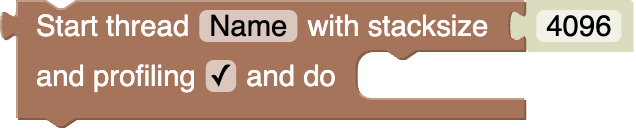

**Description:** Starts a thread

**Type:** Custom Statement Block

**Message:** `Start thread %1 with stacksize %2 and profiling %3 and do %4`

**Inputs:**

| Name | Type | Accepted types |
|------|------|---------------|
| STACKSIZE | Value | Number |
| DO | Statement | Any |

**Fields:**

| Name | Type | Options / Default |
|------|------|-----------------|
| NAME | Text input | Default: `Name` |
| PROFILING | Checkbox | Default: `TRUE` |

---

### mh_wait

**Description:** Wait

**Type:** Custom Statement Block

**Message:** `Wait %1ms`

**Inputs:**

| Name | Type | Accepted types |
|------|------|---------------|
| VALUE | Value | Number |

---

### mh_stopthread

**Description:** Stops a thread

**Type:** Custom Statement Block

**Message:** `Stop thread %1`

**Inputs:**

| Name | Type | Accepted types |
|------|------|---------------|
| HANDLE | Value | Any |

---

## Logic

### controls_if

**Description:** Conditional block that executes code based on a condition

**Type:** Standard Blockly Statement Block

**Inputs:**

| Name | Type | Accepted types |
|------|------|---------------|
| IF0 | Value | Boolean |
| DO0 | Statement | Any |

---

### logic_compare

**Description:** Compare two values (equal, not equal, less than, greater than, etc.)

**Type:** Standard Blockly Value Block

**Inputs:**

| Name | Type | Accepted types |
|------|------|---------------|
| A | Value | Any |
| B | Value | Any |

**Fields:**

| Name | Type | Options / Default |
|------|------|-----------------|
| OP | Dropdown | `=`, `≠`, `‏<`, `‏≤`, `‏>`, `‏≥` |

---

### logic_operation

**Description:** Logical operations (AND, OR)

**Type:** Standard Blockly Value Block

**Inputs:**

| Name | Type | Accepted types |
|------|------|---------------|
| A | Value | Boolean |
| B | Value | Boolean |

**Fields:**

| Name | Type | Options / Default |
|------|------|-----------------|
| OP | Dropdown | `and`, `or` |

---

### logic_negate

**Description:** Negate a boolean value (NOT)

**Type:** Standard Blockly Value Block

**Inputs:**

| Name | Type | Accepted types |
|------|------|---------------|
| BOOL | Value | Boolean |

---

### logic_boolean

**Description:** Boolean value (true or false)

**Type:** Standard Blockly Value Block

**Fields:**

| Name | Type | Options / Default |
|------|------|-----------------|
| BOOL | Dropdown | `true`, `false` |

---

### logic_null

**Description:** Null value

**Type:** Standard Blockly Value Block

---

### logic_ternary

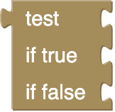

**Description:** Ternary conditional (if-then-else expression)

**Type:** Standard Blockly Value Block

**Inputs:**

| Name | Type | Accepted types |
|------|------|---------------|
| IF | Value | Boolean |
| THEN | Value | Any |
| ELSE | Value | Any |

---

## Loop

### controls_repeat_ext

**Description:** Repeat a set of statements a specified number of times

**Type:** Standard Blockly Statement Block

**Inputs:**

| Name | Type | Accepted types |
|------|------|---------------|
| TIMES | Value | Number |
| DO | Statement | Any |

---

### controls_for

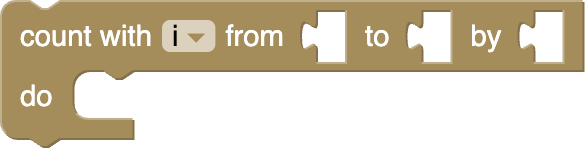

**Description:** Count from a start number to an end number by a given increment

**Type:** Standard Blockly Statement Block

**Inputs:**

| Name | Type | Accepted types |
|------|------|---------------|
| FROM | Value | Number |
| TO | Value | Number |
| BY | Value | Number |
| DO | Statement | Any |

**Fields:**

| Name | Type | Options / Default |
|------|------|-----------------|
| VAR | Variable | Default: `i` |

---

### controls_flow_statements

**Description:** Break out of or continue a loop

**Type:** Standard Blockly Statement Block

**Fields:**

| Name | Type | Options / Default |
|------|------|-----------------|
| FLOW | Dropdown | `break out`, `continue with next iteration` |

---

## Math

### math_number

**Description:** A number value

**Type:** Standard Blockly Value Block

**Fields:**

| Name | Type | Options / Default |
|------|------|-----------------|
| NUM | Number | Default: `0` |

---

### math_arithmetic

**Description:** Arithmetic operations (add, subtract, multiply, divide, power)

**Type:** Standard Blockly Value Block

**Inputs:**

| Name | Type | Accepted types |
|------|------|---------------|
| A | Value | Number |
| B | Value | Number |

**Fields:**

| Name | Type | Options / Default |
|------|------|-----------------|
| OP | Dropdown | `+`, `-`, `×`, `÷`, `^` |

---

### math_single

**Description:** Single number operations (square root, absolute, negate, etc.)

**Type:** Standard Blockly Value Block

**Inputs:**

| Name | Type | Accepted types |
|------|------|---------------|
| NUM | Value | Number |

**Fields:**

| Name | Type | Options / Default |
|------|------|-----------------|
| OP | Dropdown | `square root`, `absolute`, `-`, `ln`, `log10`, `e^`, `10^` |

---

### math_trig

**Description:** Trigonometric functions (sin, cos, tan, asin, acos, atan)

**Type:** Standard Blockly Value Block

**Inputs:**

| Name | Type | Accepted types |
|------|------|---------------|
| NUM | Value | Number |

**Fields:**

| Name | Type | Options / Default |
|------|------|-----------------|
| OP | Dropdown | `sin`, `cos`, `tan`, `asin`, `acos`, `atan` |

---

### math_constant

**Description:** Mathematical constants (pi, e, phi, sqrt(2), etc.)

**Type:** Standard Blockly Value Block

**Fields:**

| Name | Type | Options / Default |
|------|------|-----------------|
| CONSTANT | Dropdown | `π`, `e`, `φ`, `sqrt(2)`, `sqrt(½)`, `∞` |

---

### math_number_property

**Description:** Check if a number has a property (even, odd, prime, etc.)

**Type:** Standard Blockly Value Block

**Inputs:**

| Name | Type | Accepted types |
|------|------|---------------|
| NUMBER_TO_CHECK | Value | Number |

**Fields:**

| Name | Type | Options / Default |
|------|------|-----------------|
| PROPERTY | Dropdown | `even`, `odd`, `prime`, `whole`, `positive`, `negative`, `divisible by` |

---

### math_round

**Description:** Round a number (round, round up, round down)

**Type:** Standard Blockly Value Block

**Inputs:**

| Name | Type | Accepted types |
|------|------|---------------|
| NUM | Value | Number |

**Fields:**

| Name | Type | Options / Default |
|------|------|-----------------|
| OP | Dropdown | `round`, `round up`, `round down` |

---

### math_on_list

**Description:** Perform operation on a list (sum, min, max, average, etc.)

**Type:** Standard Blockly Value Block

**Inputs:**

| Name | Type | Accepted types |
|------|------|---------------|
| LIST | Value | Array |

**Fields:**

| Name | Type | Options / Default |
|------|------|-----------------|
| OP | Dropdown | `sum`, `min`, `max`, `average`, `median`, `modes`, `standard deviation`, `random item` |

---

### math_modulo

**Description:** Remainder of division

**Type:** Standard Blockly Value Block

**Inputs:**

| Name | Type | Accepted types |
|------|------|---------------|
| DIVIDEND | Value | Number |
| DIVISOR | Value | Number |

---

### math_constrain

**Description:** Constrain a number to be within specified limits

**Type:** Standard Blockly Value Block

**Inputs:**

| Name | Type | Accepted types |
|------|------|---------------|
| VALUE | Value | Number |
| LOW | Value | Number |
| HIGH | Value | Number |

---

### math_random_int

**Description:** Random integer between two numbers

**Type:** Standard Blockly Value Block

**Inputs:**

| Name | Type | Accepted types |
|------|------|---------------|
| FROM | Value | Number |
| TO | Value | Number |

---

### math_random_float

**Description:** Random fraction between 0 and 1

**Type:** Standard Blockly Value Block

---

### math_atan2

**Description:** Arctangent of the quotient of two numbers

**Type:** Standard Blockly Value Block

**Inputs:**

| Name | Type | Accepted types |
|------|------|---------------|
| X | Value | Number |
| Y | Value | Number |

---

## Text

### text

**Description:** A text string

**Type:** Standard Blockly Value Block

**Fields:**

| Name | Type | Options / Default |
|------|------|-----------------|
| TEXT | Text input | - |

---

### text_join

**Description:** Join multiple text strings together

**Type:** Standard Blockly Value Block

**Inputs:**

| Name | Type | Accepted types |
|------|------|---------------|
| ADD0 | Value | Any |
| ADD1 | Value | Any |

---

### text_append

**Description:** Append text to a variable

**Type:** Standard Blockly Statement Block

**Inputs:**

| Name | Type | Accepted types |
|------|------|---------------|
| TEXT | Value | Any |

**Fields:**

| Name | Type | Options / Default |
|------|------|-----------------|
| VAR | Variable | Default: `item` |

---

### text_length

**Description:** Get the length of a text string

**Type:** Standard Blockly Value Block

**Inputs:**

| Name | Type | Accepted types |
|------|------|---------------|
| VALUE | Value | String, Array |

---

### text_isEmpty

**Description:** Check if a text string is empty

**Type:** Standard Blockly Value Block

**Inputs:**

| Name | Type | Accepted types |
|------|------|---------------|
| VALUE | Value | String, Array |

---

### text_indexOf

**Description:** Find the position of text within text

**Type:** Standard Blockly Value Block

**Inputs:**

| Name | Type | Accepted types |
|------|------|---------------|
| VALUE | Value | String |
| FIND | Value | String |

**Fields:**

| Name | Type | Options / Default |
|------|------|-----------------|
| END | Dropdown | `first`, `last` |

---

### text_charAt

**Description:** Get a character at a specific position

**Type:** Standard Blockly Value Block

**Inputs:**

| Name | Type | Accepted types |
|------|------|---------------|
| VALUE | Value | String |
| AT | Value | Number |

**Fields:**

| Name | Type | Options / Default |
|------|------|-----------------|
| WHERE | Dropdown | `letter #`, `letter # from end`, `first letter`, `last letter`, `random letter` |

---

### text_getSubstring

**Description:** Get a substring from text

**Type:** Standard Blockly Value Block

**Inputs:**

| Name | Type | Accepted types |
|------|------|---------------|
| STRING | Value | String |
| AT1 | Value | Number |
| AT2 | Value | Number |

**Fields:**

| Name | Type | Options / Default |
|------|------|-----------------|
| WHERE1 | Dropdown | `letter #`, `letter # from end`, `first letter` |
| WHERE2 | Dropdown | `letter #`, `letter # from end`, `last letter` |

---

### text_changeCase

**Description:** Change the case of text (UPPERCASE, lowercase, Title Case)

**Type:** Standard Blockly Value Block

**Inputs:**

| Name | Type | Accepted types |
|------|------|---------------|
| TEXT | Value | String |

**Fields:**

| Name | Type | Options / Default |
|------|------|-----------------|
| CASE | Dropdown | `UPPER CASE`, `lower case`, `Title Case` |

---

### text_trim

**Description:** Trim spaces from the start and/or end of text

**Type:** Standard Blockly Value Block

**Inputs:**

| Name | Type | Accepted types |
|------|------|---------------|
| TEXT | Value | String |

**Fields:**

| Name | Type | Options / Default |
|------|------|-----------------|
| MODE | Dropdown | `both sides`, `left side`, `right side` |

---

### text_count

**Description:** Count occurrences of text within text

**Type:** Standard Blockly Value Block

**Inputs:**

| Name | Type | Accepted types |
|------|------|---------------|
| SUB | Value | String |
| TEXT | Value | String |

---

### text_replace

**Description:** Replace text within text

**Type:** Standard Blockly Value Block

**Inputs:**

| Name | Type | Accepted types |
|------|------|---------------|
| FROM | Value | String |
| TO | Value | String |
| TEXT | Value | String |

---

### text_print

**Description:** Print text to the console

**Type:** Standard Blockly Statement Block

**Inputs:**

| Name | Type | Accepted types |
|------|------|---------------|
| TEXT | Value | Any |

---

## Lists

### lists_create_empty

**Description:** Create an empty list

**Type:** Standard Blockly Value Block

---

### lists_create_with

**Description:** Create a list with specified values

**Type:** Standard Blockly Value Block

**Inputs:**

| Name | Type | Accepted types |
|------|------|---------------|
| ADD0 | Value | Any |
| ADD1 | Value | Any |
| ADD2 | Value | Any |

---

### lists_repeat

**Description:** Create a list with a value repeated a number of times

**Type:** Standard Blockly Value Block

**Inputs:**

| Name | Type | Accepted types |
|------|------|---------------|
| ITEM | Value | Any |
| NUM | Value | Number |

---

### lists_length

**Description:** Get the length of a list

**Type:** Standard Blockly Value Block

**Inputs:**

| Name | Type | Accepted types |
|------|------|---------------|
| VALUE | Value | String, Array |

---

### lists_isEmpty

**Description:** Check if a list is empty

**Type:** Standard Blockly Value Block

**Inputs:**

| Name | Type | Accepted types |
|------|------|---------------|
| VALUE | Value | String, Array |

---

### lists_indexOf

**Description:** Find the position of an item in a list

**Type:** Standard Blockly Value Block

**Inputs:**

| Name | Type | Accepted types |
|------|------|---------------|
| VALUE | Value | Array |
| FIND | Value | Any |

**Fields:**

| Name | Type | Options / Default |
|------|------|-----------------|
| END | Dropdown | `first`, `last` |

---

### lists_getIndex

**Description:** Get an item from a list at a specific position

**Type:** Standard Blockly Value Block

**Inputs:**

| Name | Type | Accepted types |
|------|------|---------------|
| VALUE | Value | Array |
| AT | Value | Number |

**Fields:**

| Name | Type | Options / Default |
|------|------|-----------------|
| MODE | Dropdown | `get`, `get and remove`, `remove` |
| SPACE | Field | - |
| WHERE | Dropdown | `#`, `# from end`, `first`, `last`, `random` |

---

### lists_setIndex

**Description:** Set an item in a list at a specific position

**Type:** Standard Blockly Statement Block

**Inputs:**

| Name | Type | Accepted types |
|------|------|---------------|
| LIST | Value | Array |
| AT | Value | Number |
| TO | Value | Any |

**Fields:**

| Name | Type | Options / Default |
|------|------|-----------------|
| MODE | Dropdown | `set`, `insert at` |
| SPACE | Field | - |
| WHERE | Dropdown | `#`, `# from end`, `first`, `last`, `random` |

---

### lists_getSublist

**Description:** Get a sublist from a list

**Type:** Standard Blockly Value Block

**Inputs:**

| Name | Type | Accepted types |
|------|------|---------------|
| LIST | Value | Array |
| AT1 | Value | Number |
| AT2 | Value | Number |

**Fields:**

| Name | Type | Options / Default |
|------|------|-----------------|
| WHERE1 | Dropdown | `#`, `# from end`, `first` |
| WHERE2 | Dropdown | `#`, `# from end`, `last` |

---

### lists_split

**Description:** Split text into a list, or join a list into text

**Type:** Standard Blockly Value Block

**Inputs:**

| Name | Type | Accepted types |
|------|------|---------------|
| INPUT | Value | String |
| DELIM | Value | String |

**Fields:**

| Name | Type | Options / Default |
|------|------|-----------------|
| MODE | Dropdown | `list from text`, `text from list` |

---

### lists_sort

**Description:** Sort a list

**Type:** Standard Blockly Value Block

**Inputs:**

| Name | Type | Accepted types |
|------|------|---------------|
| LIST | Value | Array |

**Fields:**

| Name | Type | Options / Default |
|------|------|-----------------|
| TYPE | Dropdown | `numeric`, `alphabetic`, `alphabetic, ignore case` |
| DIRECTION | Dropdown | `ascending`, `descending` |

---

### lists_reverse

**Description:** Reverse a list

**Type:** Standard Blockly Value Block

**Inputs:**

| Name | Type | Accepted types |
|------|------|---------------|
| LIST | Value | Array |

---

## I/O

### mh_digitalwrite

**Description:** Set the state of a GPIO pin

**Type:** Custom Statement Block

**Message:** `Digital write %2 to %1`

**Inputs:**

| Name | Type | Accepted types |
|------|------|---------------|
| VALUE | Value | Any |

**Fields:**

| Name | Type | Options / Default |
|------|------|-----------------|
| PIN | Dropdown | `GPIO13`, `GPIO16`, `GPIO17`, `GPIO25`, `GPIO26`, `GPIO27`, `GPIO32`, `GPIO33`, `UART1_GP4`, `UART1_GP5`, `UART1_GP6`, `UART1_GP7`, `UART2_GP4`, `UART2_GP5`, `UART2_GP6`, `UART2_GP7` |

---

### mh_pinmode

**Description:** Set the mode of a GPIO pin

**Type:** Custom Statement Block

**Message:** `Set pin mode of %1 to %2`

**Fields:**

| Name | Type | Options / Default |
|------|------|-----------------|
| PIN | Dropdown | `GPIO13`, `GPIO16`, `GPIO17`, `GPIO25`, `GPIO26`, `GPIO27`, `GPIO32`, `GPIO33`, `UART1_GP4`, `UART1_GP5`, `UART1_GP6`, `UART1_GP7`, `UART2_GP4`, `UART2_GP5`, `UART2_GP6`, `UART2_GP7` |
| MODE | Dropdown | `PINMODE_INPUT`, `PINMODE_INPUT_PULLUP`, `PINMODE_INPUT_PULLDOWN`, `PINMODE_OUTPUT` |

---

### mh_digitalread

**Description:** Liest den Zustand eines GPIO-Pins

**Type:** Custom Value Block

**Message:** `Digital Read %1`

**Fields:**

| Name | Type | Options / Default |
|------|------|-----------------|
| PIN | Dropdown | `GPIO13`, `GPIO16`, `GPIO17`, `GPIO25`, `GPIO26`, `GPIO27`, `GPIO32`, `GPIO33`, `GPIO34`, `GPIO35`, `GPIO36`, `GPIO39`, `UART1_GP4`, `UART1_GP5`, `UART1_GP6`, `UART1_GP7`, `UART2_GP4`, `UART2_GP5`, `UART2_GP6`, `UART2_GP7` |

---

### mh_port

**Description:** A LEGO© intergface port

**Type:** Custom Value Block

**Message:** `%1`

**Fields:**

| Name | Type | Options / Default |
|------|------|-----------------|
| PORT | Dropdown | `PORT1`, `PORT2`, `PORT3`, `PORT4` |

---

### mh_set_motor_speed

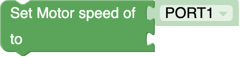

**Description:** Set the speed of a connected motor

**Type:** Custom Statement Block

**Message:** `Set Motor speed of %1 to %2`

**Inputs:**

| Name | Type | Accepted types |
|------|------|---------------|
| PORT | Value | Any |
| VALUE | Value | Any |

---

## LEGO©

### lego_get_device_mode

**Description:** Returns the currently selected mode index of a port

**Type:** Custom Value Block

**Message:** `Selected mode of %1`

**Inputs:**

| Name | Type | Accepted types |
|------|------|---------------|
| PORT | Value | Any |

---

### lego_get_mode_dataset

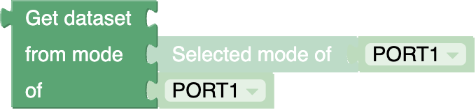

**Description:** Get a dataset value from a specific mode of a port

**Type:** Custom Value Block

**Message:** `Get dataset %3 from mode %2 of %1`

**Inputs:**

| Name | Type | Accepted types |
|------|------|---------------|
| DATASET | Value | Any |
| MODE | Value | Any |
| PORT | Value | Any |

---

### lego_select_mode

**Description:** Sets the mode of a port

**Type:** Custom Statement Block

**Message:** `Set the mode of %1 to %2`

**Inputs:**

| Name | Type | Accepted types |
|------|------|---------------|
| PORT | Value | Any |
| MODE | Value | Any |

---

## Gamepad

### mh_gamepad_gamepad

**Description:** A Gamepad connection

**Type:** Custom Value Block

**Message:** `%1`

**Fields:**

| Name | Type | Options / Default |
|------|------|-----------------|
| GAMEPAD | Dropdown | `GAMEPAD1` |

---

### mh_gamepad_buttonpressed

**Description:** Checks if a specific button is pressed on a connected gamepad

**Type:** Custom Value Block

**Message:** `Checks if %2 is pressed on %1`

**Inputs:**

| Name | Type | Accepted types |
|------|------|---------------|
| GAMEPAD | Value | Any |

**Fields:**

| Name | Type | Options / Default |
|------|------|-----------------|
| BUTTON | Dropdown | `GAMEPAD_BUTTON_1`, `GAMEPAD_BUTTON_1`, `GAMEPAD_BUTTON_2`, `GAMEPAD_BUTTON_4`, `GAMEPAD_BUTTON_5`, `GAMEPAD_BUTTON_6`, `GAMEPAD_BUTTON_7`, `GAMEPAD_BUTTON_8`, `GAMEPAD_BUTTON_9`, `GAMEPAD_BUTTON_10`, `GAMEPAD_BUTTON_11`, `GAMEPAD_BUTTON_12`, `GAMEPAD_BUTTON_13`, `GAMEPAD_BUTTON_14`, `GAMEPAD_BUTTON_15`, `GAMEPAD_BUTTON_16` |

---

### mh_gamepad_buttonsraw

**Description:** Gets the raw button values of a Gamepad in as a 32bit integer

**Type:** Custom Value Block

**Message:** `Gets the raw button values of %1`

**Inputs:**

| Name | Type | Accepted types |
|------|------|---------------|
| GAMEPAD | Value | Any |

---

### mh_gamepad_value

**Description:** Gets a value from a connected Gamepad

**Type:** Custom Value Block

**Message:** `Get %2 from %1`

**Inputs:**

| Name | Type | Accepted types |
|------|------|---------------|
| GAMEPAD | Value | Any |

**Fields:**

| Name | Type | Options / Default |
|------|------|-----------------|
| VALUE | Dropdown | `GAMEPAD_LEFT_X`, `GAMEPAD_LEFT_Y`, `GAMEPAD_RIGHT_X`, `GAMEPAD_RIGHT_Y`, `GAMEPAD_DPAD` |

---

### mh_gamepad_connected

**Description:** Tests if the Gamepad is connected

**Type:** Custom Value Block

**Message:** `Test if %1 is connected`

**Inputs:**

| Name | Type | Accepted types |
|------|------|---------------|
| GAMEPAD | Value | Any |

---

## FastLED

### mh_fastled_addleds

**Description:** Initialize FastLED

**Type:** Custom Statement Block

**Message:** `Initialize FastLED of type %1 on pin %2 with %3 LEDs`

**Inputs:**

| Name | Type | Accepted types |
|------|------|---------------|
| NUM_LEDS | Value | Any |

**Fields:**

| Name | Type | Options / Default |
|------|------|-----------------|
| TYPE | Dropdown | `NEOPIXEL` |
| PIN | Dropdown | `GPIO13`, `GPIO16`, `GPIO17`, `GPIO25`, `GPIO26`, `GPIO27`, `GPIO32`, `GPIO33` |

---

### mh_fastled_show

**Description:** Shop current FastLED values to the LED strip

**Type:** Custom Statement Block

**Message:** `FastLED show`

---

### mh_fastled_clear

**Description:** Clear current FastLED values and sent them to the LED strip

**Type:** Custom Statement Block

**Message:** `FastLED clear`

---

### mh_fastled_set

**Description:** Set LED color

**Type:** Custom Statement Block

**Message:** `Set LED #%1 to color %2`

**Inputs:**

| Name | Type | Accepted types |
|------|------|---------------|
| INDEX | Value | Any |

**Fields:**

| Name | Type | Options / Default |
|------|------|-----------------|
| COLOR | Colour picker | Default: `#00a000` |

---

## IMU

### mh_imu_value

**Description:** Gets a value from the IMU

**Type:** Custom Value Block

**Message:** `Get %1 from IMU`

**Fields:**

| Name | Type | Options / Default |
|------|------|-----------------|
| VALUE | Dropdown | `YAW`, `PITCH`, `ROLL`, `ACCELERATION_X`, `ACCELERATION_Y`, `ACCELERATION_Z` |

---

## UI

### ui_show_value

**Description:** Show value on the UI

**Type:** Custom Statement Block

**Message:** `Show value %1: %2 with style %3`

**Inputs:**

| Name | Type | Accepted types |
|------|------|---------------|
| VALUE | Value | Any |

**Fields:**

| Name | Type | Options / Default |
|------|------|-----------------|
| LABEL | Text input | Default: `Label` |
| STYLE | Dropdown | `FORMAT_SIMPLE` |

---

### ui_map_update

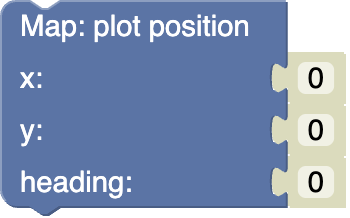

**Description:** Sends the current robot position to the map visualization panel. x and y in meters, heading in degrees. Internally rate-limited to ~5 Hz. See DEADRECKONING.md for details.

**Type:** Custom Statement Block

**Message:** `Map: plot position %1 x: %2 y: %3 heading: %4`

**Inputs:**

| Name | Type | Accepted types |
|------|------|---------------|
| X | Value | Number |
| Y | Value | Number |
| HEADING | Value | Number |

**See also:** [Documentation](https://github.com/mirkosertic/Megahub/DEADRECKONING.md)

---

### ui_map_clear

**Description:** Clears the map trail in the visualization panel. See DEADRECKONING.md for details.

**Type:** Custom Statement Block

**Message:** `Map: clear`

**See also:** [Documentation](https://github.com/mirkosertic/Megahub/DEADRECKONING.md)

---

## Algorithms

### mh_alg_pid_init

**Description:** Creates a new PID controller instance and returns a handle. Store this in a variable for use with PID compute and reset blocks.

**Type:** Custom Value Block

**Message:** `Initialize PID`

---

### mh_alg_pid_compute

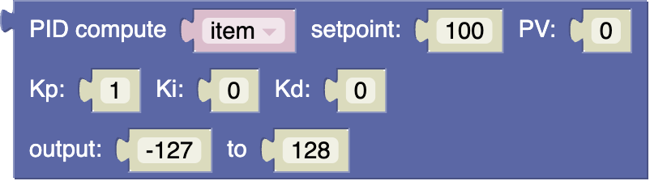

**Description:** Computes PID control output. The handle comes from "Initialize PID" block. Returns the control value clamped to output range.

**Type:** Custom Value Block

**Message:** `PID compute %1 %2 setpoint: %3 PV: %4 
%5 Kp: %6 Ki: %7 Kd: %8 %9 
output: %10 to %11`

**Inputs:**

| Name | Type | Accepted types |
|------|------|---------------|
| HANDLE | Value | Any |
| SETPOINT | Value | Number |
| PV | Value | Number |
| KP | Value | Number |
| KI | Value | Number |
| KD | Value | Number |
| OUT_MIN | Value | Number |
| OUT_MAX | Value | Number |

---

### mh_alg_pid_reset

**Description:** Resets PID controller state (clears integral accumulator and error history). Use when switching setpoints or restarting control.

**Type:** Custom Statement Block

**Message:** `Reset PID %1`

**Inputs:**

| Name | Type | Accepted types |
|------|------|---------------|
| HANDLE | Value | Any |

---

### mh_alg_dr_init

**Description:** Creates a new dead reckoning instance and returns a handle. Store this in a variable for use with other DR blocks.

**Type:** Custom Value Block

**Message:** `Initialize DR`

**See also:** [Documentation](https://github.com/mirkosertic/Megahub/DEADRECKONING.md)

---

### mh_alg_dr_update

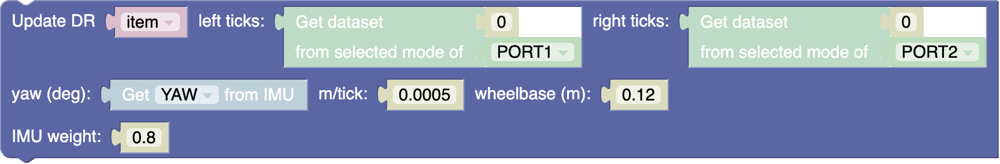

**Description:** Updates the dead reckoning state with new encoder and IMU readings. The handle comes from the "Initialize DR" block stored in a variable. Requires LEGO motor in POS mode (selectmode port 2). See DEADRECKONING.md for algorithm details.

**Type:** Custom Statement Block

**Message:** `Update DR %1 %2 left ticks: %3 right ticks: %4 
%5 yaw (deg): %6 m/tick: %7 wheelbase (m): %8 
%9 IMU weight: %10`

**Inputs:**

| Name | Type | Accepted types |
|------|------|---------------|
| HANDLE | Value | Any |
| LEFT_TICKS | Value | Number |
| RIGHT_TICKS | Value | Number |
| YAW | Value | Number |
| M_PER_TICK | Value | Number |
| WHEELBASE | Value | Number |
| IMU_WEIGHT | Value | Number |

**See also:** [Documentation](https://github.com/mirkosertic/Megahub/DEADRECKONING.md)

---

### mh_alg_dr_get

**Description:** Gets a pose component (X/Y in meters, HEADING in degrees) from a dead reckoning instance. Connect the handle from a DR update block variable. See DEADRECKONING.md for details.

**Type:** Custom Value Block

**Message:** `DR pose %1 of %2`

**Inputs:**

| Name | Type | Accepted types |
|------|------|---------------|
| HANDLE | Value | Any |

**Fields:**

| Name | Type | Options / Default |
|------|------|-----------------|
| FIELD | Dropdown | `X`, `Y`, `HEADING` |

**See also:** [Documentation](https://github.com/mirkosertic/Megahub/DEADRECKONING.md)

---

### mh_alg_dr_reset

**Description:** Resets the dead reckoning pose to (0, 0, 0°). The next update call re-bootstraps tick tracking so no spurious jump occurs. See DEADRECKONING.md for details.

**Type:** Custom Statement Block

**Message:** `Reset DR pose of %1`

**Inputs:**

| Name | Type | Accepted types |
|------|------|---------------|
| HANDLE | Value | Any |

**See also:** [Documentation](https://github.com/mirkosertic/Megahub/DEADRECKONING.md)

---

### mh_alg_dr_set_pose

**Description:** Injects a known absolute pose (x, y in meters; heading in degrees) into the dead reckoning state. Use when a landmark is detected to correct accumulated drift. See DEADRECKONING.md for details.

**Type:** Custom Statement Block

**Message:** `Set DR pose of %1 %2 x: %3 y: %4 heading: %5`

**Inputs:**

| Name | Type | Accepted types |
|------|------|---------------|
| HANDLE | Value | Any |
| X | Value | Number |
| Y | Value | Number |
| HEADING | Value | Number |

**See also:** [Documentation](https://github.com/mirkosertic/Megahub/DEADRECKONING.md)

---

### mh_alg_moving_avg_init

**Description:** Creates a new moving average filter instance and returns a handle. Store this in a variable and pass it to the Moving average block.

**Type:** Custom Value Block

**Message:** `Initialize moving average`

---

### mh_alg_moving_avg

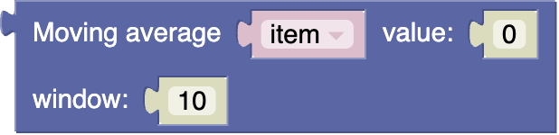

**Description:** Smooths a sensor value using a ring-buffer moving average. The handle comes from the "Initialize moving average" block stored in a variable. Window is the number of samples to average (2–50; default 10). On first call the buffer is pre-filled so there is no startup ramp.

**Type:** Custom Value Block

**Message:** `Moving average %1 %2 value: %3 
%4 window: %5`

**Inputs:**

| Name | Type | Accepted types |
|------|------|---------------|
| HANDLE | Value | Any |
| VALUE | Value | Number |
| WINDOW | Value | Number |

---

### mh_alg_map

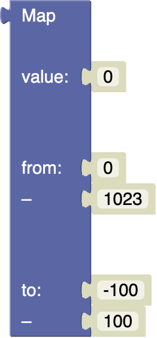

**Description:** Linearly maps a value from one range to another. Equivalent to Arduino map() but with float support. Output is not clamped — values outside the input range extrapolate linearly.

**Type:** Custom Value Block

**Message:** `Map %1 %2 value: %3 
%4 from: %5 – %6 
%7 to: %8 – %9`

**Inputs:**

| Name | Type | Accepted types |
|------|------|---------------|
| VALUE | Value | Number |
| IN_MIN | Value | Number |
| IN_MAX | Value | Number |
| OUT_MIN | Value | Number |
| OUT_MAX | Value | Number |

---

### mh_alg_hysteresis_init

**Description:** Creates a new hysteresis (Schmitt trigger) instance and returns a handle. Store in a variable and pass to the Hysteresis block.

**Type:** Custom Value Block

**Message:** `Initialize hysteresis`

**See also:** [Documentation](https://github.com/mirkosertic/Megahub/FILTERS.md)

---

### mh_alg_hysteresis

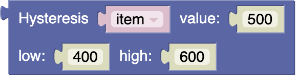

**Description:** Hysteresis (Schmitt trigger) filter. Output switches to 1 when value exceeds high threshold, and back to 0 when value drops below low threshold. Eliminates chatter near a threshold. Returns 0 or 1.

**Type:** Custom Value Block

**Message:** `Hysteresis %1 %2 value: %3 
%4 low: %5 high: %6`

**Inputs:**

| Name | Type | Accepted types |
|------|------|---------------|
| HANDLE | Value | Any |
| VALUE | Value | Number |
| LOW | Value | Number |
| HIGH | Value | Number |

**See also:** [Documentation](https://github.com/mirkosertic/Megahub/FILTERS.md)

---

### mh_alg_debounce_init

**Description:** Creates a new debounce filter instance and returns a handle. Store in a variable and pass to the Debounce block.

**Type:** Custom Value Block

**Message:** `Initialize debounce`

**See also:** [Documentation](https://github.com/mirkosertic/Megahub/FILTERS.md)

---

### mh_alg_debounce

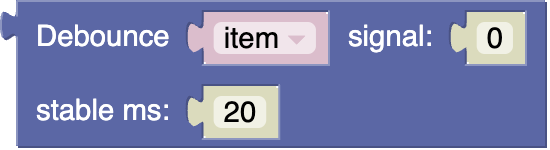

**Description:** Debounce filter for buttons and digital sensors. Output only changes when the input has been stable for the specified number of milliseconds. Returns 0 or 1. Typical stable time: 20–50 ms.

**Type:** Custom Value Block

**Message:** `Debounce %1 %2 signal: %3 
%4 stable ms: %5`

**Inputs:**

| Name | Type | Accepted types |
|------|------|---------------|
| HANDLE | Value | Any |
| SIGNAL | Value | Number |
| STABLE_MS | Value | Number |

**See also:** [Documentation](https://github.com/mirkosertic/Megahub/FILTERS.md)

---

### mh_alg_rate_limit_init

**Description:** Creates a new rate limiter instance and returns a handle. Store in a variable and pass to the Rate limiter block.

**Type:** Custom Value Block

**Message:** `Initialize rate limiter`

**See also:** [Documentation](https://github.com/mirkosertic/Megahub/FILTERS.md)

---

### mh_alg_rate_limit

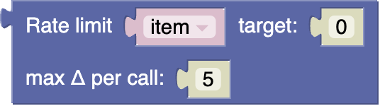

**Description:** Rate limiter (slew rate). Limits how fast the output value can change per call to avoid sudden jumps. On first call returns target immediately. The effective rate in units/second depends on how often the block is called.

**Type:** Custom Value Block

**Message:** `Rate limit %1 %2 target: %3 
%4 max Δ per call: %5`

**Inputs:**

| Name | Type | Accepted types |
|------|------|---------------|
| HANDLE | Value | Any |
| TARGET | Value | Number |
| MAX_DELTA | Value | Number |

**See also:** [Documentation](https://github.com/mirkosertic/Megahub/FILTERS.md)

---

### mh_alg_kalman_init

**Description:** Creates a new 1D Kalman filter instance and returns a handle. Store in a variable and pass to the Kalman filter block.

**Type:** Custom Value Block

**Message:** `Initialize Kalman filter`

**See also:** [Documentation](https://github.com/mirkosertic/Megahub/FILTERS.md)

---

### mh_alg_kalman

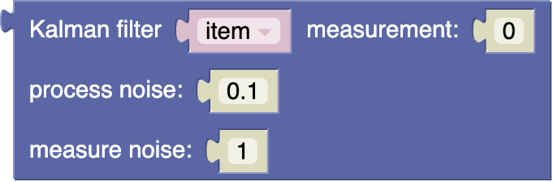

**Description:** Kalman filter. Weighs measurements by noise characteristics for principled smoothing. Process noise Q: how much the true value drifts per call. Measure noise R: sensor variance. Starting values: color sensor Q=0.01 R=10, IMU Q=0.1 R=1.0.

**Type:** Custom Value Block

**Message:** `Kalman filter %1 %2 measurement: %3 
%4 process noise: %5 
%6 measure noise: %7`

**Inputs:**

| Name | Type | Accepted types |
|------|------|---------------|
| HANDLE | Value | Any |
| MEASUREMENT | Value | Number |
| PROCESS_NOISE | Value | Number |
| MEASURE_NOISE | Value | Number |

**See also:** [Documentation](https://github.com/mirkosertic/Megahub/FILTERS.md)

---

## Debug

### mh_debug_free_heap

**Description:** Get free HEAP memory

**Type:** Custom Value Block

**Message:** `Get free HEAP memory`

---

### mh_debug_millis

**Description:** Get the number of milliseconds since system startup

**Type:** Custom Value Block

**Message:** `Get milliseconds since system startup`

---

## Generation Statistics

- Total blocks: 94
- Custom Megahub blocks: 46
- Standard Blockly blocks: 48
- PNG images generated: 94

---

*Documentation generated automatically from block definitions with high-quality PNG screenshots.*
