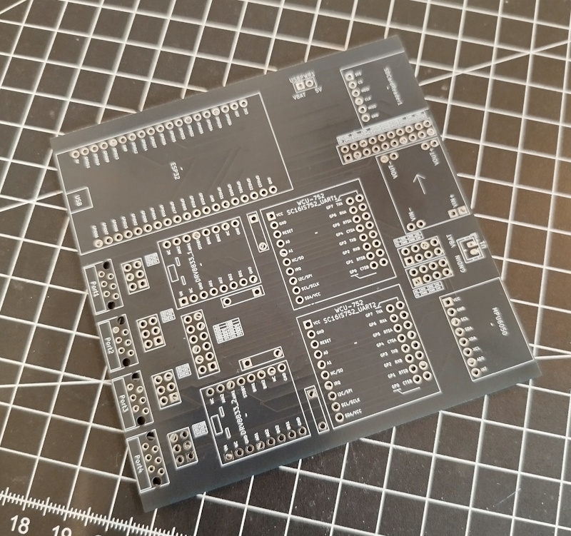

# Megahub

## Introduction

Megahub is an ESP32-based alternative hub designed for LEGO&copy; enthusiasts and robotics builders. It combines the flexibility of the ESP32 platform with native support for LEGO&copy; WeDo/Powered Up! devices, offering both Lua scripting and Blockly visual programming for easy control and automation.

This project provides a powerful, open-source alternative to proprietary solutions, giving makers complete control over their robotic creations while maintaining compatibility with popular LEGO&copy; sensors and motors.
It comes with the hardware schematics, production files and the Megahub firmware as a PlatformIO project as well.

** Use it at your own Risk!! **

## Key Features

- **KiCad**: All schematics and PCB production files are available in KiCad and Gerber format
- **WiFi Enabled**: Built-in wireless connectivity for remote control and programming
- **4 UART Ports**: Connect up to 4 LEGO&copy; WeDo/Powered Up! devices simultaneously (motors, sensors, etc.)
- **Built-in IMU**: Integrated MPU6050 6-axis accelerometer and gyroscope for motion sensing
- **FastLED/NeoPixel Support**: Built-in support for addressable RGB LED strips
- **Flexible GPIO**: Additional GPIO pins available for custom sensors, buttons, and peripherals
- **Visual Programming Interface**: Blockly visual programming for beginners
- **Web-based Interface**: Configure and program your hub through an intuitive Web UI
- **ROS(Robot Operating System)**: Micro ROS support is comming soon...
- **MQTT**: MQTT support is comming soon...

## How It Differs from Existing Solutions

### vs. LEGO&copy; Powered Up!

- **Open Source**: Complete control over firmware and functionality
- **Expandable**: Access to additional GPIO pins for custom hardware
- **Programming Flexibility**: Choose between Lua scripting or visual programming
- **Built-in Features**: Integrated IMU and LED controller without additional hubs
- **Cost-effective**: Based on affordable ESP32 hardware

### vs. fischertechnik&copy; RX Controller

- **LEGO Compatibility**: Native support for LEGO WeDo 2.0 protocol
- **Web-based Programming**: No proprietary software required
- **Cost-effective**: Based on affordable ESP32 hardware
- **Visual Programming**: Blockly support makes it accessible for all skill levels

## Hardware Photos

## WebUI Screenshots

_Screenshots of the WebUI in action will be added here_

## Getting Started

Documentation coming soon...
