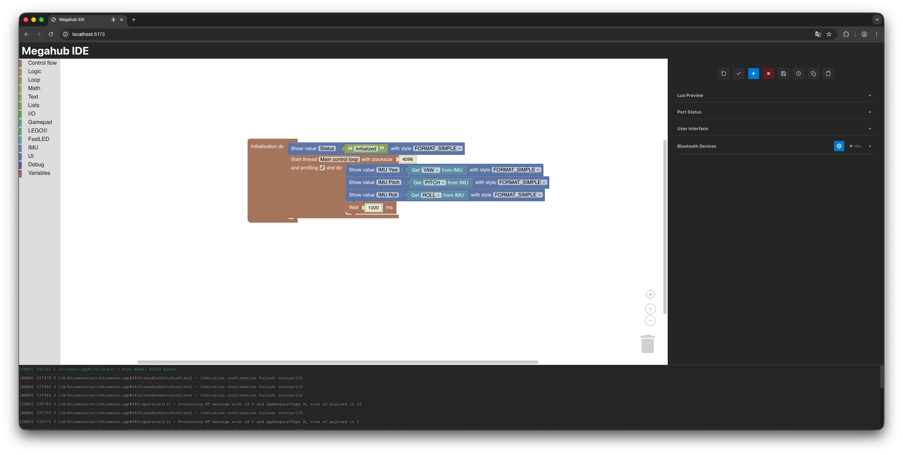

# Megahub


## Introduction

Megahub is an ESP32-based alternative hub designed for LEGO© enthusiasts and robotics builders. It combines the flexibility of the ESP32 platform with native support for LEGO© WeDo/Powered Up! devices, offering both Lua scripting and Blockly visual programming for easy control and automation.

This project provides a powerful, open-source alternative to proprietary solutions, giving makers complete control over their robotic creations while maintaining compatibility with popular LEGO© sensors and motors.
It comes with the hardware schematics, production files and the Megahub firmware as a PlatformIO project as well.

**Build and use it at your own Risk!!**

## Key Features

- **KiCad**: All schematics and PCB production files are available in KiCad and Gerber format
- **WiFi Enabled**: Built-in wireless connectivity for remote control and programming
- **Bluetooth Enabled**: Acts as a Bluetooth BLE Server and Client
- **IDE**: Configure and program Megahub through the intuitive [Megahub IDE](https://mirkosertic.github.io/Megahub/)
- **Visual Programming Interface**: Blockly visual programming for beginners
- **SD-Card**: Built-in SD-card reader to store multiple projects (autostart possible)
- **4 UART Ports**: Connect up to 4 LEGO© WeDo/Powered Up! devices simultaneously (motors, sensors, etc.)
- **Built-in IMU**: Integrated MPU6050 6-axis accelerometer and gyroscope for motion sensing
- **FastLED/NeoPixel Support**: Built-in support for addressable RGB LED strips
- **Flexible GPIO**: Additional GPIO pins available for custom sensors, buttons, and peripherals
- **ROS(Robot Operating System)**: Micro ROS support is comming soon...
- **MQTT**: MQTT support is comming soon...
- **Gamepad**: Bluetooth Gamepad support is comming soon...
- **BT/WiFi switch**: Allow configuration over Bluetooth API instead of Restful HTTP API is comming soon...

## Why not Micropython on existing hardware?

- I wanted to learn something new
- Designing Hard- and Software work together is fun
- There is no truly open system with the same capabilities available

## How It Differs from Existing Solutions

### vs. LEGO© Powered Up!

- **Open Source**: Complete control over firmware and functionality
- **Expandable**: Access to additional GPIO pins for custom hardware
- **Programming Flexibility**: Choose between Lua scripting or visual programming
- **Built-in Features**: Integrated IMU and LED controller without additional hubs
- **Cost-effective**: Based on affordable ESP32 hardware

### vs. fischertechnik© RX Controller

- **LEGO Compatibility**: Native support for LEGO© WeDo 2.0 protocol
- **Web-based Programming**: No proprietary software required
- **Cost-effective**: Based on affordable ESP32 hardware
- **Visual Programming**: Blockly support makes it accessible for all skill levels

## WebUI Screenshots

**Project management**


**IMU interaction**


**Lego / Gamepad interaction**


## Hardware Photos


## Getting Started

### Prerequisites

- [PlatformIO](https://platformio.org/) installed (either as a CLI tool or as a VSCode extension)
- An ESP32 development board
- USB cable for flashing

### Building the Firmware

1. Clone the repository:
   ```bash
   git clone https://github.com/mirkosertic/Megahub.git
   cd Megahub
   ```

2. Build the project using PlatformIO:
   ```bash
   pio run
   ```

   Or if using VSCode with the PlatformIO extension, click the **Build** button in the bottom toolbar.

### Flashing the Board

1. Connect your ESP32 board via USB.

2. Flash the firmware:
   ```bash
   pio run --target upload
   ```

   Or use the **Upload** button in the PlatformIO toolbar in VSCode.

### First Boot and Configuration

By default, the Megahub firmware runs in **Bluetooth mode**. To configure your board and start programming:

1. Open the [Megahub IDE](https://mirkosertic.github.io/Megahub/) in your web browser.

2. The web-based IDE uses the Web Bluetooth API to connect to your Megahub device. Make sure you are using a compatible browser (Chrome, Edge, or Opera on desktop).

3. Click **Connect** in the IDE and select your Megahub device from the Bluetooth pairing dialog.

4. Once connected, you can configure WiFi settings, upload projects, and program your device using either Lua scripting or Blockly visual programming.

### Serial Monitor

To view debug output from the board:
```bash
pio device monitor
```

The default baud rate is 115200.
