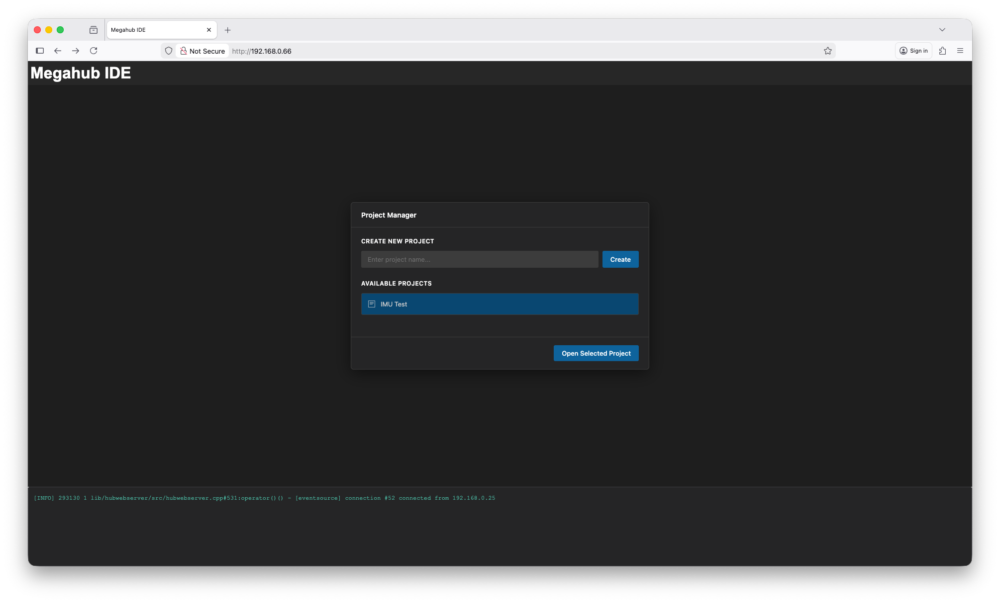
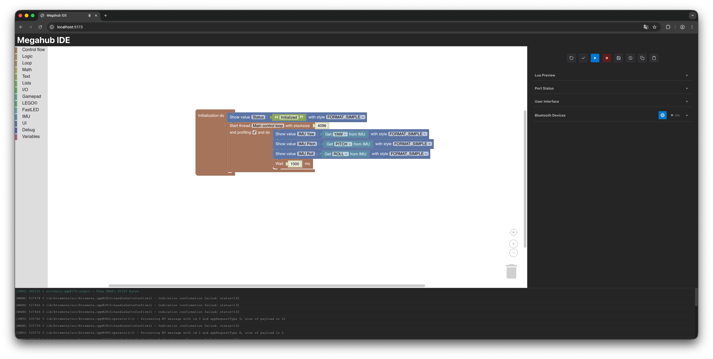
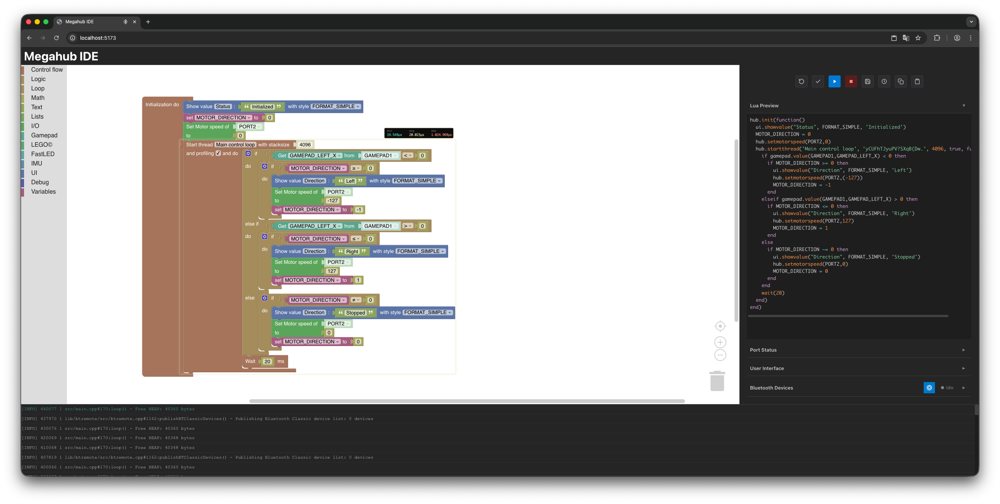
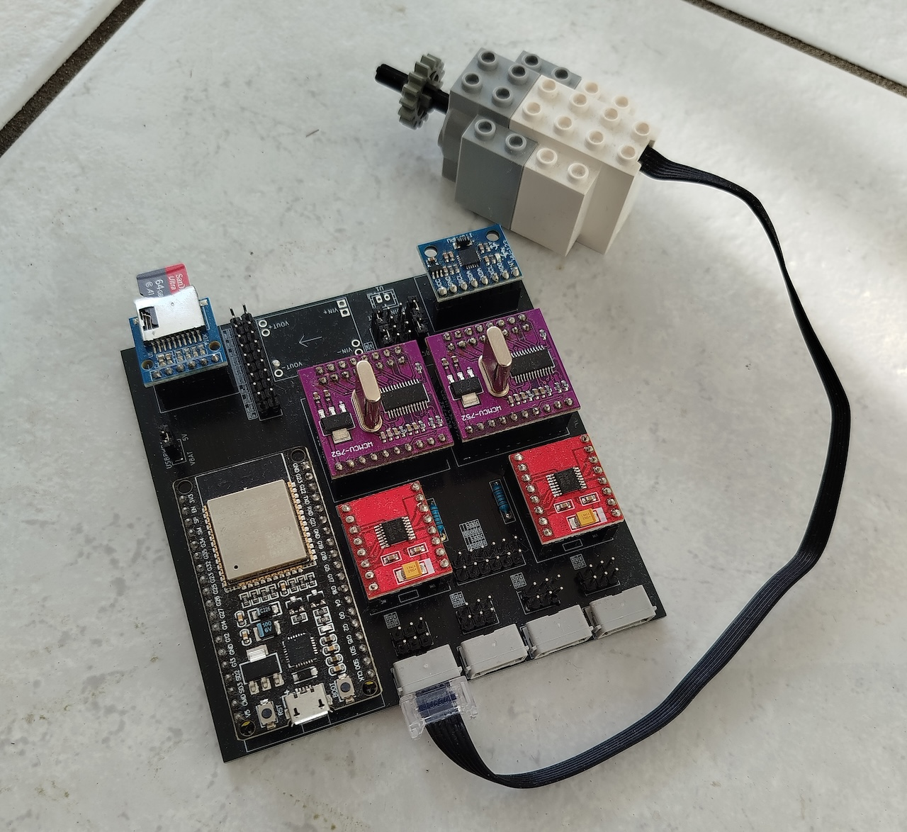

# Megahub


## Introduction

Megahub is an ESP32-based experimentation platform for robotics enthusiasts and makers. It combines native support for LEGO WeDo/Powered Up devices with a web-based IDE featuring Lua scripting and Blockly visual programming. The project is fully open source and ships with hardware schematics, PCB production files, and firmware as a PlatformIO project.

**Build and use it at your own risk.**

---

## Key Features

- **KiCad schematics**: All schematics and PCB production files are available in KiCad and Gerber format
- **WiFi**: Built-in wireless connectivity for remote control and programming
- **Bluetooth**: Acts as a BLE (Bluetooth Low Energy) server and Bluetooth Classic client simultaneously
- **Web IDE**: Configure and program Megahub through the [Megahub IDE](https://mirkosertic.github.io/Megahub/)
- **Visual programming**: Blockly drag-and-drop programming for beginners and rapid prototyping
- **Lua scripting**: Full Lua 5.4 scripting for advanced users
- **SD card storage**: Store multiple projects on an SD card; the IDE remembers which project was last selected for autostart
- **4 LEGO device ports**: Connect up to 4 LEGO WeDo 2.0/Powered Up motors, sensors, and other devices simultaneously
- **IMU**: Integrated MPU6050 6-axis accelerometer and gyroscope for motion sensing
- **FastLED/NeoPixel**: Built-in support for WS2812B addressable RGB LED strips
- **GPIO expansion**: Additional GPIO pins for custom sensors, buttons, and peripherals
- **Gamepad support**: Pair a Bluetooth Classic HID gamepad (e.g., 8BitDo M30) for manual control

---

## Screenshots

**Project management**


**IMU interaction**


**LEGO and Gamepad interaction**


---

## Hardware Photos



---

## Getting Started

### Prerequisites

- [PlatformIO](https://platformio.org/) installed as a CLI tool or as a VSCode extension
- An ESP32 development board
- USB cable for flashing
- Chrome, Edge, or Opera desktop browser (required for the Web Bluetooth API)

### Building the Firmware

1. Clone the repository:
   ```bash
   git clone https://github.com/mirkosertic/Megahub.git
   cd Megahub
   ```

2. Build the project:
   ```bash
   pio run
   ```
   Or click **Build** in the PlatformIO toolbar inside VSCode.

### Flashing the Board

1. Connect the ESP32 board via USB.

2. Flash the firmware:
   ```bash
   pio run --target upload
   ```
   Or click **Upload** in the PlatformIO toolbar inside VSCode.

### First Boot and Connection

The device starts in **Bluetooth mode** by default.

1. Open the [Megahub IDE](https://mirkosertic.github.io/Megahub/) in Chrome, Edge, or Opera on a desktop computer.
2. Click **Connect** in the IDE.
3. Select your Megahub device from the browser's Bluetooth pairing dialog.
4. Once connected, the IDE shows the project list and the logger output.

### Serial Monitor

View diagnostic output from the board:
```bash
pio device monitor
```
Default baud rate: **115200**.

---

## Hardware Reference

### LEGO Device Ports

Megahub provides **4 LEGO device ports**, numbered **1 to 4**. Each port uses the LEGO Powered Up UART protocol. Two SC16IS752 I2C-to-UART bridge chips translate between the ESP32 and the LEGO connectors: **bridge chip 1** (UART1) drives ports 1 and 2, **bridge chip 2** (UART2) drives ports 3 and 4. Each chip also exposes four additional GPIO pins (GP4–GP7) that can be used for custom sensors or buttons — see `UART1_GP4`–`UART2_GP7` in [LUAAPI.md](LUAAPI.md). All four ports are available from Blockly.

Motor speed range: **-127** (full reverse) to **+127** (full forward). Zero stops the motor.

### GPIO Pins

**FastLED / NeoPixel output** — use any of these GPIO pins for WS2812B LED strips: **13, 16, 17, 25, 26, 27, 32, 33**.

**SD card (SPI bus)**:

| Signal | GPIO |
|--------|------|
| CLK    | 18   |
| MOSI   | 23   |
| MISO   | 19   |
| CS     | 4    |

**IMU (I2C)**: The MPU6050 is connected to the I2C bus. Its address and pins are fixed in hardware.

### Supported LEGO Devices

Megahub supports LEGO WeDo 2.0 and Powered Up devices that communicate over the LEGO Powered Up UART (LUMP) protocol. This includes motors, color and distance sensors, tilt sensors, and other compatible devices. See the [LUMP Protocol Documentation](LUMP.md) for the full technical specification.

---

## Using the IDE

### Connecting

The [Megahub IDE](https://mirkosertic.github.io/Megahub/) runs entirely in your browser and communicates over BLE when the device is in Bluetooth mode.

**Supported browsers**: Chrome, Edge, Opera (desktop only). Firefox and Safari do not support the Web Bluetooth API and cannot connect to the device.

Steps:
1. Open the IDE in a supported browser.
2. Click **Connect**.
3. Select the Megahub device from the pairing dialog.
4. The IDE connects and shows the project list on the left and a logger panel on the right.

### Creating a Project

1. Click **New project** in the project list.
2. Enter a name for the project.
3. The IDE opens the Blockly workspace for that project.

### Programming with Blockly

The Blockly workspace lets you build programs visually without writing code.

1. Find a block in the **toolbox** on the left side of the workspace. Blocks are grouped by category: Control flow, LEGO, Gamepad, FastLED, IMU, I/O, Math, and more.
2. Drag a block onto the canvas and connect it to other blocks.
3. As you build, the IDE generates the corresponding Lua code automatically — expand the **Lua Preview** panel in the sidebar to inspect it.
4. When the program is ready, click **Execute** to send and run it on the device.
5. Output and log messages from the running program appear in the **Logger** panel.

For a visual reference of every available block, see [BLOCKS.md](BLOCKS.md).

### Toolbox Category Guide

The toolbox is divided into these categories:

| Category | What it contains |
|----------|-----------------|
| **Control flow** | `Initialization` block, `Start thread`, `Wait`, `Stop thread` |
| **Logic** | If/else, comparisons (=, ≠, <, >), AND/OR, NOT, boolean values |
| **Loop** | Repeat N times, count-for loop, break/continue |
| **Math** | Arithmetic, rounding, trigonometry, random numbers, constrain |
| **Text** | String operations; **Print to Logger** |
| **Lists** | Create, read, write, sort, and split lists |
| **I/O** | **Set motor speed**, GPIO read/write, pin mode, port selector |
| **LEGO©** | Select sensor mode on a port, read sensor dataset |
| **Gamepad** | Button pressed, analog axis values, connection check |
| **FastLED** | Initialize LED strip, set individual LED colour, show, clear |
| **IMU** | Read yaw, pitch, roll, or acceleration from the on-board sensor |
| **UI** | Display a labelled value in the IDE Logger panel, map visualization (plot position, clear) |
| **Algorithms** | PID controller (init/compute/reset), dead reckoning (init/update/get/reset/set pose) |
| **Debug** | Free heap memory, milliseconds since boot |

> **Common gotcha:** The **Set motor speed** block is in the **I/O** category — not **LEGO©**. The **LEGO©** category only contains sensor blocks (selecting a measurement mode and reading the sensor dataset). If you want to drive a motor, open **I/O**.

### Running and Stopping Programs

- Click **Execute** to upload and start the program.
- Click **Stop** to halt a running program at any time.
- The Logger panel shows output in real time.

### Autostart

You can mark a project as the autostart project. When the IDE connects to the device, it reads the autostart setting and opens that project automatically.

In the IDE project list, find the project you want and toggle the **autostart** switch. This writes the following file to the SD card:

```json
{ "project": "your-project-id" }
```

The file is stored at `/autostart.json` on the SD card. To clear the autostart selection, toggle the switch off in the IDE or delete the file from the SD card.

---

## WiFi Mode

By default Megahub runs in Bluetooth mode. You can switch to WiFi mode to access the web interface over your local network.

### Switching from Bluetooth to WiFi Mode

1. Insert an SD card into the device.
2. Create a file named `config.json` in the root of the SD card with the following content:
   ```json
   {
     "bluetoothEnabled": false,
     "wifiEnabled": true,
     "ssid": "YourNetwork",
     "pwd": "YourPassword"
   }
   ```
3. Reboot the device. It connects to your WiFi network and starts the web server.

You can also run both Bluetooth and WiFi simultaneously by setting both `bluetoothEnabled` and `wifiEnabled` to `true`.

### config.json Reference

| Field              | Type    | Default | Description                        |
|--------------------|---------|---------|------------------------------------|
| `bluetoothEnabled` | boolean | `true`  | Enable BLE and Bluetooth Classic   |
| `wifiEnabled`      | boolean | `false` | Connect to WiFi and start web server |
| `ssid`             | string  | —       | WiFi network name                  |
| `pwd`              | string  | —       | WiFi password                      |

### Accessing the Web UI

Once the device is connected to WiFi:
- Open `http://<device-ip>/` in any browser, **or**
- Open `http://<device-uid>.local/` (requires mDNS support — works on macOS, Linux, and Windows 10+)

The web UI provides the same project management, Blockly programming, and execution features as the Bluetooth-connected IDE. For the full REST API reference used by the web server, see [HUBAPI.md](HUBAPI.md).

---

## Gamepad Support

### Pairing a Gamepad

Scanning and pairing are done from the IDE while the device is connected in Bluetooth mode.

1. Open the **Bluetooth Devices** panel in the IDE sidebar.
2. Click the **Scan** button (circular icon at the top of the panel). The panel shows "Scanning…" while the firmware searches for nearby Bluetooth Classic devices.
3. Put your gamepad into pairing mode so it becomes discoverable.
4. The gamepad appears in the list with its name, MAC address, device type, and signal strength.
5. Click **Pair Device** on the gamepad entry. The firmware initiates pairing; the entry updates to show a **Paired** badge.
6. Once paired, the gamepad state is available to your Blockly programs immediately.

To remove a pairing, click **Remove Pairing** on the paired device entry in the panel.

### Supported Gamepads

Any Bluetooth Classic HID-compatible gamepad should work. The **8BitDo M30** has been tested and confirmed to work.

Gamepad input available in Blockly:

| Input           | Range / Values              |
|-----------------|-----------------------------|
| Buttons (1–16)  | pressed / not pressed       |
| D-pad           | directional state           |
| Left stick X/Y  | -32768 to +32767            |
| Right stick X/Y | -32768 to +32767            |

### Blockly Blocks for Gamepad

The **Gamepad** category in the Blockly toolbox provides 5 blocks for reading button states, D-pad direction, and analog stick values. See [BLOCKS.md](BLOCKS.md) for the full visual reference.

---

## Hardware Features

### LEGO Powered Up

Megahub speaks the LEGO Powered Up UART protocol (LUMP) natively. Each of the 4 ports independently detects a connected device, negotiates its capabilities, and streams sensor data. Motors accept a speed value from -127 to +127. Sensors report values according to the mode you select in your Blockly program.

The **LEGO** category in the Blockly toolbox provides blocks for:
- Selecting a sensor mode on a port
- Reading the current sensor data from a port and dataset

Motor speed is set using the **Set motor speed** block in the **I/O** category.

See [LUMP.md](LUMP.md) for the complete protocol specification.

### FastLED / NeoPixel Addressable LEDs

Connect a WS2812B LED strip to any of the supported GPIO pins (13, 16, 17, 25, 26, 27, 32, or 33). The **FastLED** category in the Blockly toolbox provides 4 blocks for:
- Initializing the LED strip (type, GPIO pin, number of LEDs)
- Setting individual LED colors (RGB)
- Showing/updating the LED strip
- Clearing all LEDs

### IMU — Orientation and Acceleration

The on-board MPU6050 provides 6-axis motion data, updated every 100 ms. Read it in Blockly using the **IMU** block:

| Output          | Unit  | Description                    |
|-----------------|-------|--------------------------------|
| YAW             | °     | Rotation around vertical axis  |
| PITCH           | °     | Forward/back tilt              |
| ROLL            | °     | Left/right tilt                |
| ACCELERATION_X  | m/s²  | Acceleration along X axis      |
| ACCELERATION_Y  | m/s²  | Acceleration along Y axis      |
| ACCELERATION_Z  | m/s²  | Acceleration along Z axis      |

### Algorithm Blocks — PID and Dead Reckoning

The **Algorithms** category provides blocks for closed-loop control and position tracking.

**PID controller:** A proportional-integral-derivative controller for motor speed regulation, line following, or any closed-loop control. Uses an explicit lifecycle:
1. **Init PID** — creates a new controller instance, returns a handle
2. **PID compute** — computes control output using the handle, setpoint, process variable, and gains
3. **PID reset** — clears the state of an existing controller (e.g., when switching setpoints)

Store the handle from `Init PID` in a variable and pass it to `PID compute` in your control loop.

**Dead reckoning (DR):** Estimates the robot's (x, y, heading) pose by integrating wheel encoder ticks and IMU yaw. The following blocks are available:

| Block | Description |
|-------|-------------|
| `Init DR` | Creates a new dead reckoning instance and returns a handle. Call once before your main loop. |
| `DR update` | Updates pose from left/right encoder ticks and IMU yaw. Takes 7 inputs: handle, left ticks, right ticks, yaw (deg), m/tick, wheelbase (m), IMU weight. Does not return a value. |
| `DR pose X/Y/HEADING of` | Reads one component of the pose from a handle — X and Y in meters, HEADING in degrees. |
| `Reset DR pose of` | Resets pose to origin (0, 0, 0°). Re-bootstraps encoder baselines so the next update produces zero delta. |
| `Set DR pose of` | Injects a known (x, y, heading) position for landmark-based drift correction. |

**LEGO motor POS mode prerequisite:** DR reads absolute encoder positions. Before using DR blocks, call `lego select mode` with mode **2** (POS) on the motor ports in `hub.init()`, then wait briefly for the sensor to settle.

For a full explanation including the math, calibration procedure, coordinate conventions, and example programs, see [DEADRECKONING.md](DEADRECKONING.md).

### Map Visualization

The IDE sidebar includes a **live map panel** that renders the robot's trail as it moves. Use the **UI** category blocks to drive it:

| Block | Description |
|-------|-------------|
| `Map: plot position` | Sends an (x, y, heading) pose to the map panel. Wire in DR get blocks for x, y, and heading. The firmware rate-limits sends to 5 Hz — call at any rate in your loop. |
| `Map: clear` | Clears the trail from the map panel. Call this at the start of each run alongside `Reset DR pose`. |

### SD Card Storage

Projects created in the IDE are saved to the SD card. The SD card connects over SPI (CLK=18, MOSI=23, MISO=19, CS=4). Use a standard microSD card formatted as FAT32. Configuration files (`config.json`, `autostart.json`) also live in the root of the SD card.

**SD card is required.** If the SD card is absent or fails to mount at boot, the device halts immediately and cannot start.

---

## How Programs Run

Understanding this sequence explains many "why isn't it working?" situations.

### Boot sequence

1. The SD card is mounted. **If mounting fails the device halts** — nothing else starts.
2. `config.json` is read from the SD card root. WiFi and/or Bluetooth are started based on its content.
3. All four LEGO ports initialise and begin device detection in the background.
4. The device enters idle state. No program runs automatically at this point.

> **Autostart does not run a program at boot.** The autostart setting only tells the IDE which project to navigate to when you connect. The device always starts with no program running — you must click **Execute** in the IDE to start a program.

### When you click Execute

1. Any currently running program and all its threads are **stopped immediately**.
2. All four LEGO ports are **reinitialized** (motors stop, sensors reset).
3. A fresh Lua environment is created and the program runs from the top:
   - `hub.init()` — runs synchronously and completes before anything else.
   - `hub.startthread()` — each call spawns a background task that loops independently.
   - The main program body finishes. Background threads continue running.
4. Each thread loops continuously with a 1 ms scheduler yield between iterations.

### When a thread crashes

If a Lua runtime error occurs inside a thread:

- The thread exits and the error appears in the **Logger** panel.
- All four LEGO ports are reinitialized (all motors stop).
- Other threads continue running.

### When you click Stop

1. All threads receive a stop signal and exit.
2. All four LEGO ports are reinitialized (all motors stop, all sensors reset).

**Key point:** every time a program stops — by request, by crashing, or because a new Execute is sent — all motors stop and all ports reset. You never need to manually zero motors before stopping.

---

## Troubleshooting

### BLE Not Connecting

- Make sure you are using Chrome, Edge, or Opera on a **desktop** computer. Mobile browsers and Firefox/Safari do not support the Web Bluetooth API.
- Ensure Bluetooth is enabled on your computer.
- Reload the IDE page and click Connect again — the browser may need a fresh connection attempt.
- Check that no other browser tab or application is already connected to the device (only one BLE connection is active at a time).

### Device Not Found in Bluetooth Scan

- Confirm the device is powered on.
- Move the device closer to your computer — BLE range is typically 5–10 metres in open air.
- Reboot the device and try the scan again.
- If the device was previously paired with a different computer, you may need to remove it from that computer's Bluetooth settings first.

### LEGO Device Not Responding

- Check that the LEGO device cable is fully seated in the port.
- Confirm the port number in your Blockly program matches the physical port (1–4).
- Some LEGO devices require a short delay between commands. Add a **wait** block between motor commands if the device ignores rapid successive commands.
- Reboot the device. The port detection sequence runs on every startup.

### Reading the Serial Log

Connect the device via USB and run:
```bash
pio device monitor
```
The log (115200 baud) shows boot messages, port detection results, BLE connection events, and any errors from running Lua programs. Copy the relevant lines when reporting a bug.

---

## Documentation

| Document | Description |
|----------|-------------|
| [BLOCKS.md](BLOCKS.md) | Complete visual reference for all Blockly blocks, auto-generated with screenshots |
| [LUAAPI.md](LUAAPI.md) | Lua scripting API — all modules, functions, and constants available in Megahub programs |
| [BLEPROTOCOL.md](BLEPROTOCOL.md) | BLE protocol reference — GATT profile, framing, request/response and event formats |
| [HUBAPI.md](HUBAPI.md) | REST API and Server-Sent Events reference for WiFi mode |
| [LUMP.md](LUMP.md) | LEGO Powered Up UART protocol technical specification |
| [MEGAHUBIDE.md](MEGAHUBIDE.md) | Frontend IDE architecture — module structure, state, events, components, testing |
| [DEADRECKONING.md](DEADRECKONING.md) | Dead reckoning guide — intuition, kinematics, math, coordinate conventions, Blockly usage, and calibration |
